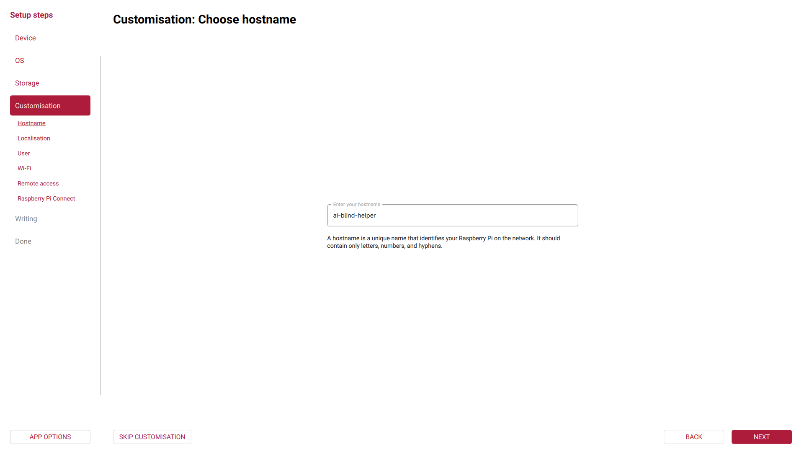
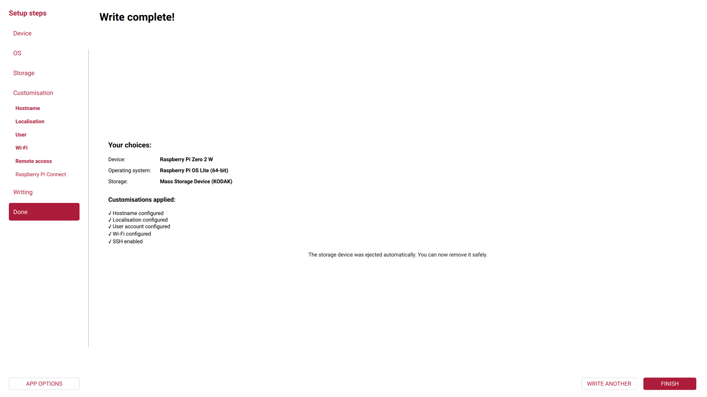

# Raspberry PI OS - Installation Guide
1. Go to https://www.raspberrypi.com/software/ and download the latest version of Raspberry Pi Imager for your operating system
   1. If you download the appimage, in case of using Linux, make shure the appimage file has the permissions marked as allow executing file as a program
   3. Ubuntu installation: `sudo apt install rpi-imager`
   4. Arch-Linux installation: `sudo pacman -S rpi-imager`
   5. Run the program as root to ensure it can write and read the SD card
   6. Some cases, like when using hyprland or wayland, a special runnig method is required, like runnig the program by preserving the everiment variables: `sudo -E rpi-imager`
2. Connect the SD card into your computer
3. Launch the Raspberry Pi Imager
4. Select the board Raspberry pi zero 2w and click next 
5. Choose Raspberry Pi OS (other) 
6. Select Raspberry Pi OS Lite (64-bit) and click next 
7. Choose your SD card and click next. Ensure you are selecting the correct device. Chosing the wrong option, like an internal drive, may cause lost of all your archives! 
8. Enter the hostname: ai-blind-helper and click next 
9. Set the localization based on your case
10. Set an username and password
11. Configure the Wi-Fi conection by entering the SSID and password
12. Very important! Enable SSH via password autentication. This feature will be used later 
13. Raspberry Pi Connect is optional. For example, i'll not enable it
14. Last thing, review the configuration and hit WRITE 
15. The application will ask you one more time. Choose I UNDERSTAND, ERASE AND WRITE 
16. After this, the download and instalation will start automaticaly
17. In the end, it will be showed you the following screen 
18. Now you can remove the SD cardEnter the hostname: 