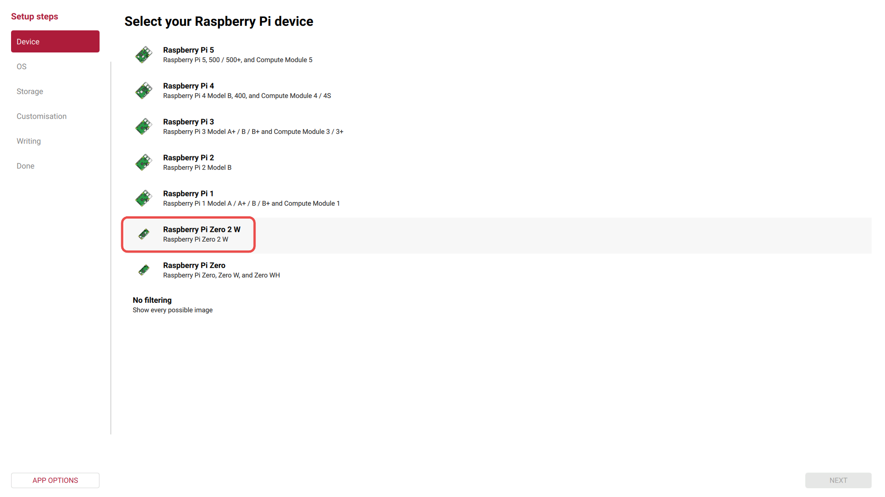
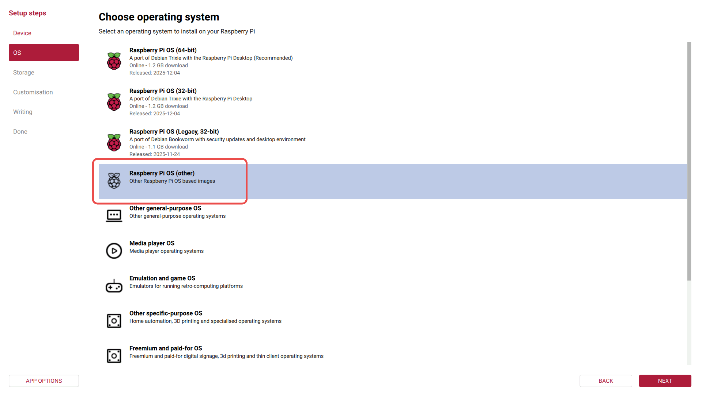
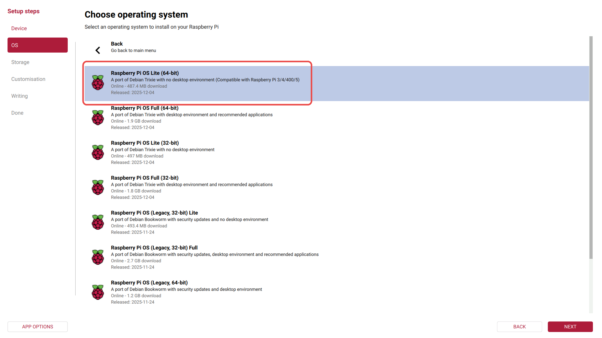
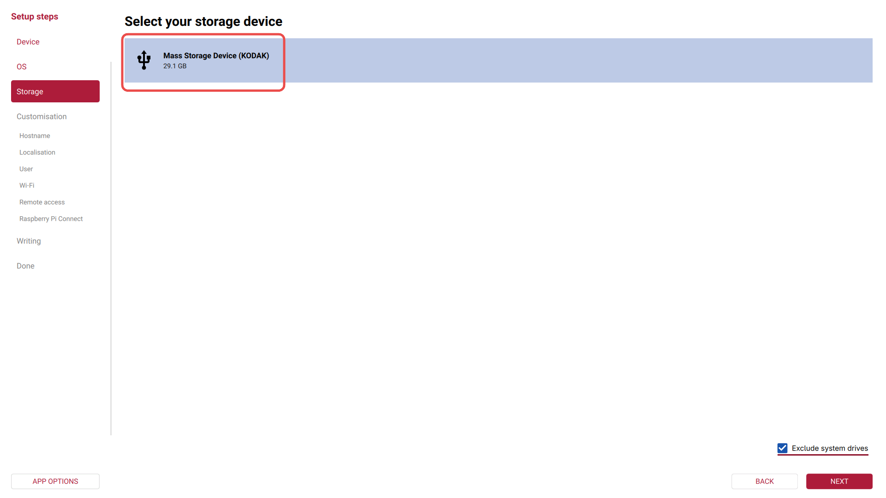
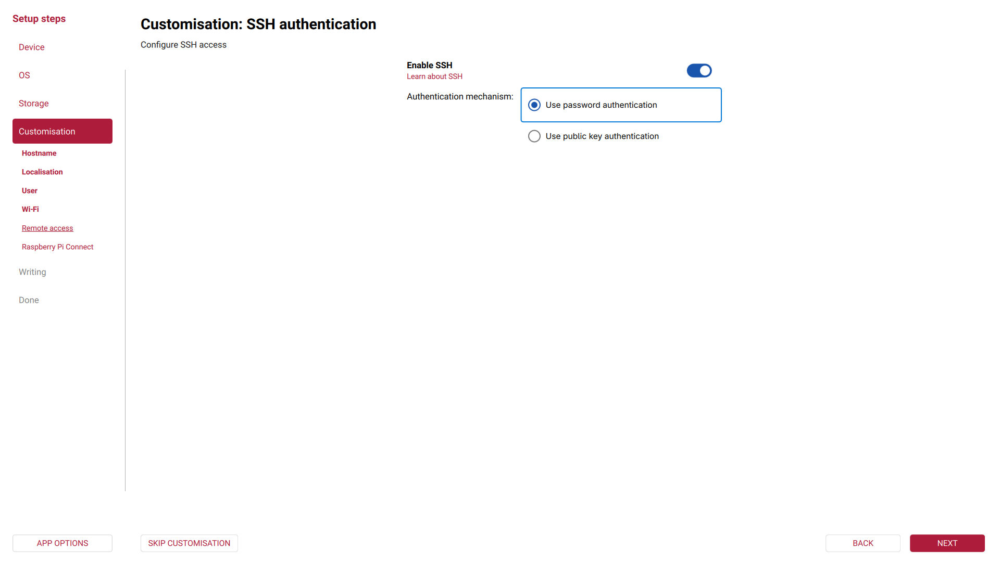
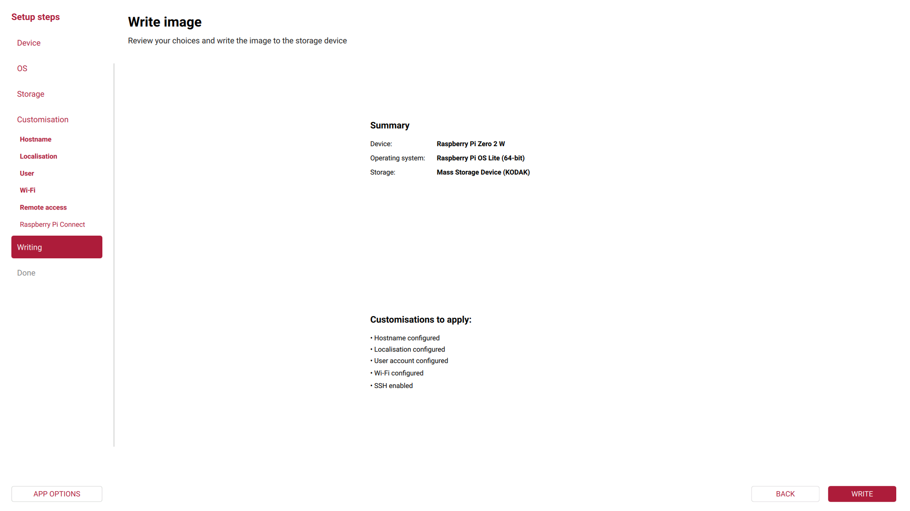
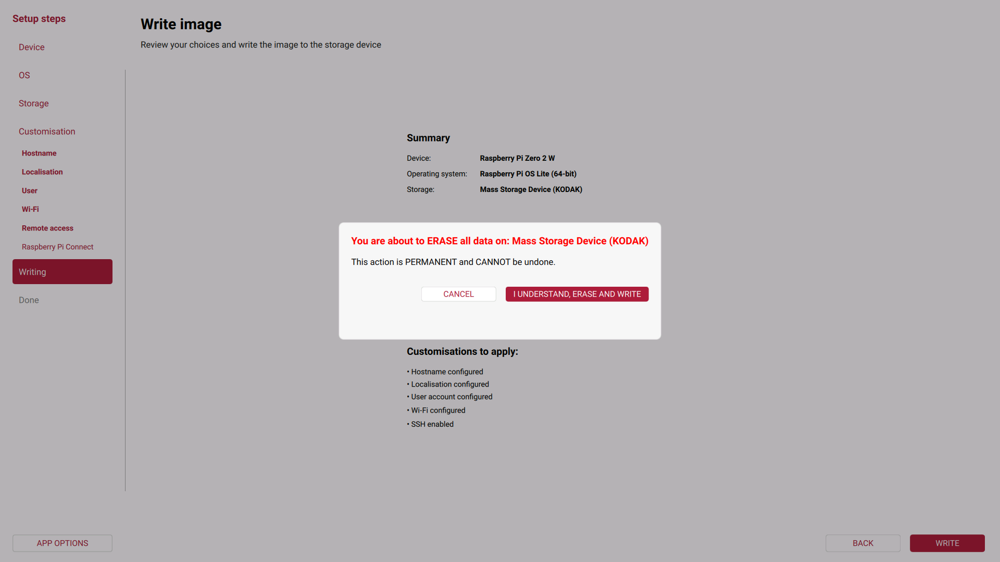

# Raspberry Pi OS - Guia de Instalação
[Clique aqui para retornar ao README](README.pt-br.md#installing-ai-blind-helper)

1. Vá para https://www.raspberrypi.com/software/ e baixe a versão mais recente do Raspberry Pi Imager para o seu sistema operacional.
   1. Se estiver usando Linux e baixar o AppImage, certifique-se de que o arquivo esteja marcado como executável.
   2. Instalação no Ubuntu: `sudo apt install rpi-imager`
   3. Instalação no Arch Linux: `sudo pacman -S rpi-imager`
   4. Execute o programa com privilégios de root para garantir que ele possa acessar e gravar no cartão SD: `sudo rpi-imager`
   5. Em alguns casos, como ao usar Hyprland ou Wayland, é necessário um método de execução especial para preservar as variáveis de ambiente: `sudo -E rpi-imager`
2. Insira o cartão SD no seu computador.
3. Inicie o Raspberry Pi Imager.
4. Selecione a placa **Raspberry Pi Zero 2 W** e clique em Avançar 
5. Escolha **Raspberry Pi OS (Other)** 
6. Selecione **Raspberry Pi OS Lite (64-bit)** e clique em Avançar 
7. Escolha o seu cartão SD e clique em Avançar. Certifique-se de selecionar o dispositivo correto. Escolher a opção errada, como uma unidade interna, pode resultar na perda de todos os seus dados! 
8. Digite o nome do host (hostname): `ai-blind-helper` e clique em Avançar 
9. Defina as configurações de localização de acordo com a sua região.
10. Defina um nome de usuário e uma senha.
11. Configure a conexão Wi-Fi inserindo seu SSID e senha.
12. **Muito importante!** Habilite o SSH via autenticação por senha. Esse recurso será exigido mais tarde. 
13. O Raspberry Pi Connect é opcional. Para este guia, ele não será ativado.
14. Por fim, revise sua configuração e clique em **GRAVAR** 
15. O aplicativo pedirá confirmação. Escolha **I UNDERSTAND, ERASE AND WRITE** 
16. Depois disso, o processo de download e instalação começará automaticamente.
17. Quando terminar, você verá a seguinte tela de confirmação 
18. Agora você pode remover o cartão SD com segurança.

[Clique aqui para retornar ao README](README.pt-br.md#installing-ai-blind-helper)