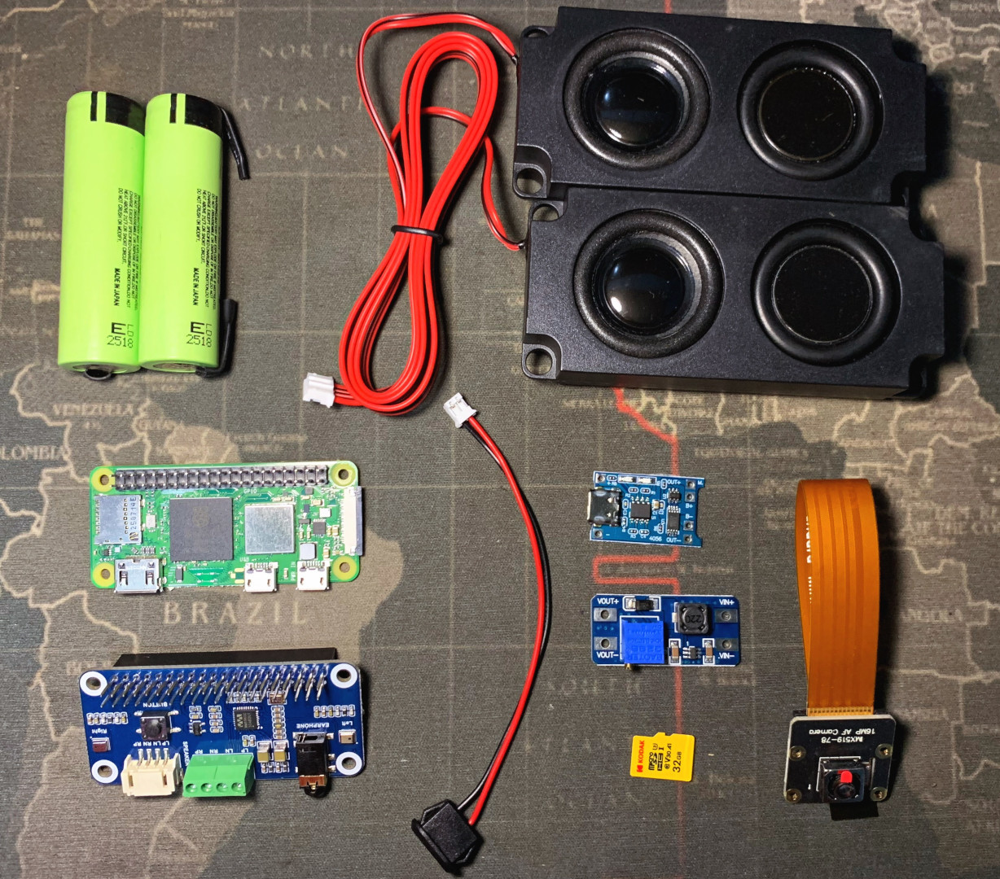

# AI Blind Helper
> 🇧🇷 [Versão em Português disponível aqui](./README.pt-br.md)

<p align="center">
  
  
  
  
  
  
</p>


> Project aimed at developing a device to assist visually impaired people in their daily lives through the integration of artificial intelligence with the real world.

## 🛠️ Adjustments and improvements

The project is still in development and the upcoming updates will be focused on the following tasks:

- [x] Audio call
- [x] Video call
- [x] Clock and date
- [ ] Environment description
- [ ] Text-to-speech transcription

## 💻 Bill of materials

The project can run on any computer that has:
- Camera
- Microphone
- Speaker
- Keyboard

However, it is highly recommended to have a dedicated device for this task in a reinforced case, such as a Raspberry Pi.

Below you can find the bill of materials as well as the purchase links:

- [Raspberry Zero 2W](https://pt.aliexpress.com/item/1005007982832720.html?spm=a2g0o.order_list.order_list_main.41.15aacaa4rBdrSw&gatewayAdapt=glo2bra)
- [Camera IMX519](https://pt.aliexpress.com/item/1005008061266530.html?spm=a2g0o.order_list.order_list_main.23.15aacaa4rBdrSw&gatewayAdapt=glo2bra)
- [USB-C Connector](https://pt.aliexpress.com/item/1005006297697300.html?spm=a2g0o.order_list.order_list_main.29.15aacaa4rBdrSw&gatewayAdapt=glo2bra)
- [Audio Module (Waveshare WM8960)](https://pt.aliexpress.com/item/1005005042024030.html?spm=a2g0o.order_list.order_list_main.5.15aacaa4rBdrSw&gatewayAdapt=glo2bra)
- [2x Lithium batteries (NCR18650B)](https://www.mercadolivre.com.br/2-bateria-18650-panasonic-ncr18650b-3450mah-10a-celula-18650/up/MLBU795527633)
- [USB charging board (TP4056)](https://pt.aliexpress.com/item/1005004427739715.html?spm=a2g0o.order_list.order_list_main.35.15aacaa4rBdrSw&gatewayAdapt=glo2bra)
- [Step up (MT3608)](https://pt.aliexpress.com/item/1005008208376182.html?spm=a2g0o.order_list.order_list_main.11.15aacaa4rBdrSw&gatewayAdapt=glo2bra)
- [SD Card 32 GB or larger](https://pt.aliexpress.com/item/1005005633435181.html?spm=a2g0o.order_list.order_list_main.17.15aacaa4rBdrSw&gatewayAdapt=glo2bra)


## Installing AI Blind Helper

First things first, you'll need to have a SD card with the operational system installed. [Click here to learn how](INSTALL.md)

After this, you'll connect the SD card into the Raspberry and power the system by the microUSB powerin connector. The system shoud boot normaly.

Wait a few minutes to the system boot up.

Find the **ip** of your raspberry by [scanning the network](https://play.google.com/store/apps/details?id=com.myprog.netscan) and connect via ssh using the credentials we set at the setup in the Raspberry Pi Imager.

You should lookup and find ai-blind-helper ip host. Then connect via ssh using (replace user by the user you set, and 10.10.10.10 by the ip you fing):
```bash
ssh user@10.10.10.10
```
Type `yes` to add and save the fingerprint, then enter the password you setup.

And run the installation script:
```bash
curl -sL https://raw.githubusercontent.com/giuliovalcanaia/ai-blind-helper/hardware/install.sh | bash
```


## 📫 Contributing to the project

To contribute, follow these steps:

1. **Fork** this repository.
2. Create a **branch** for your modification: `git checkout -b feature/my-feature`.
3. Make your changes and **commit** them: `git commit -m 'feat: add new feature'`.
4. Push to your remote repository: `git push origin feature/my-feature`.
5. Open a **Pull Request** to the original repository.

Alternatively, refer to the GitHub documentation on [how to create a pull request](https://help.github.com/en/github/collaborating-with-issues-and-pull-requests/creating-a-pull-request).

## 🤝 Collaborators

We thank the following people who contributed to this project:

<div align="center">
  <table>
    <tr>
      <td align="center">
        <a href="https://github.com/giuliovalcanaia">
          <br>
          <sub>
            <b>Giulio Luiz Valcanaia</b>
          </sub>
        </a>
      </td>
      <td align="center">
        <a href="https://github.com/arthurjosebona">
          <br>
          <sub>
            <b>Arthur José Bona</b>
          </sub>
        </a>
      </td>
    </tr>
  </table>
</div>

## 💎 Support

This project is only possible thanks to the support of [APP da Escola de Educação Básica Frei Lucínio Korte](https://www.instagram.com/freilucinio?igsh=MWhndzR3ZzV3cHF1ZA==). The hardware sponsorship demonstrates the institution's commitment to innovation and the educational inclusion of visually impaired students.

<div align="center">
  <table>
    <tr>
      <td align="center">
        <a href="https://www.instagram.com/freilucinio?igsh=MWhndzR3ZzV3cHF1ZA==">
          <br>
          <sub>
            <b>EEB Frei Lucínio Korte</b>
          </sub>
        </a>
      </td>
    </tr>
  </table>
</div>

## 📝 License

This project is under the Apache 2.0 license. See the [LICENSE](LICENSE) file for more details.
